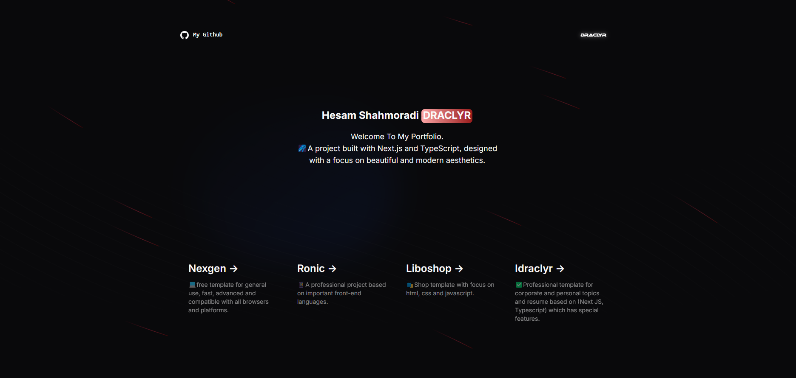
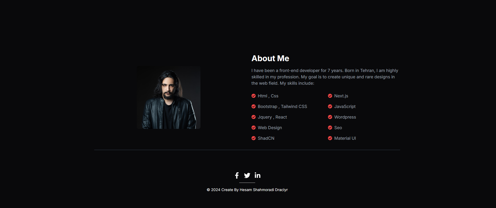

<h2>Lebor Template</h2>
<p>👽A project with a very professional and galaxy design that is very suitable for a resume topic.</p>

## Getting Started

Install the template packages via the code below:

```bash
npm install
```
And then run the project with the following code:

```bash
npm run dev
```

then Open [http://localhost:3000](http://localhost:3000) with your browser to see the result.
<br>
<p>⭐This project has a day and night theme and you can provide all your corporate or personal services in the service section:</p>

<br>
<p>🌝In the "About" section, you can enter all your abilities and relevant information in a specialized manner:</p>

<br>
<p>And finally, I will be very happy if you rate the project❤️</p>

